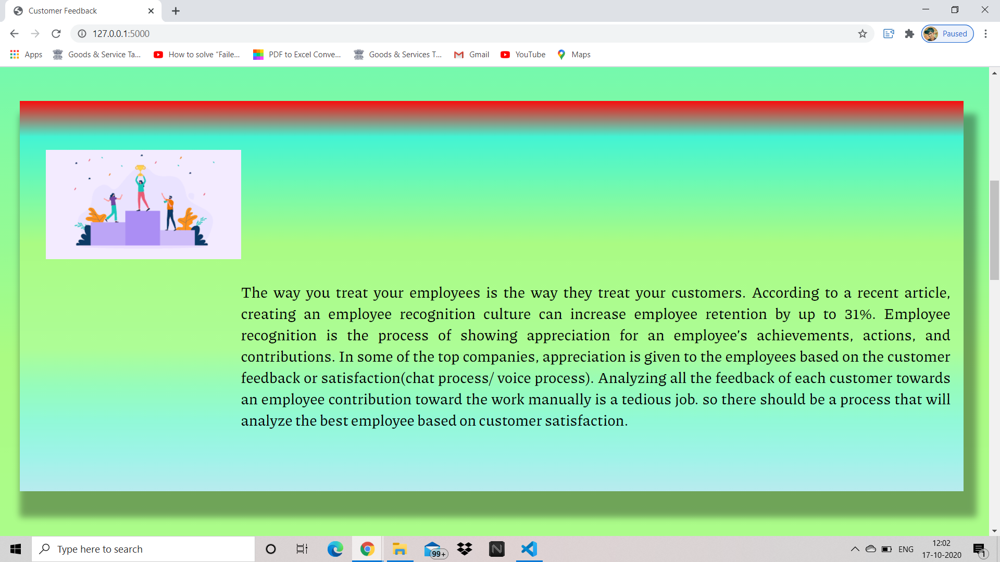

# SPS-1103-Employee-Appreciation-based-On-Customer-Satisfaction
Employee Appreciation based On Customer Satisfaction

# app.py
In this app.py file which contain all the flask code for running the aws using the python boto3 module. Initially in the webpage after getting the some details from the form it 
gives the values to the python. That pass throught the value to the amazon comprehend service. It gives the sentimental analysis.

After that it store the data to the dynamodb and update the score the particular employee that the customer point out in the form. 
# Customer_feedback.html
This is file for the complete webpage which contain the form and the some introduction about the project. And finally it display the employee score and the no of review for that employee all that will be displayed in the graphical representation. That will help us to easily identify. 

#Credential_id.py
This file is important first when we run the program we have to update the credential such as aws_access_key_id,aws_secret_access_id,aws_session_token regularly. Other wise does not able to recognise who is accessing the amazon services. 
## Final Ouput of the Web Page

Video Demostration :  https://youtu.be/xF2ekrVijzE

